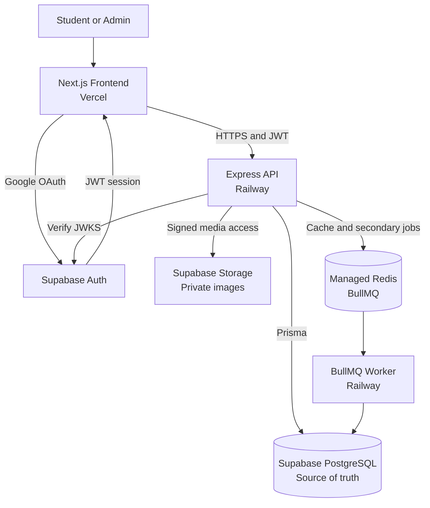
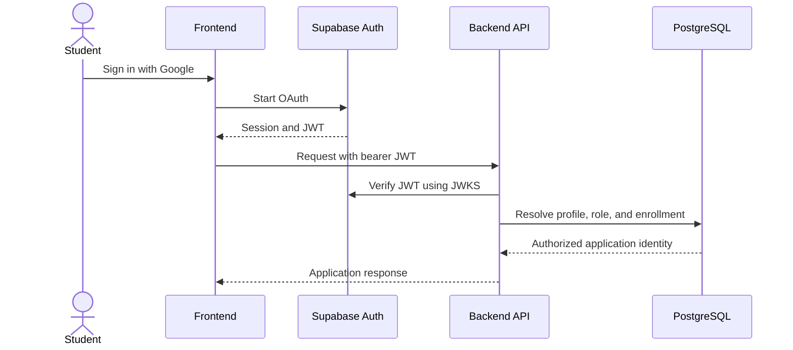
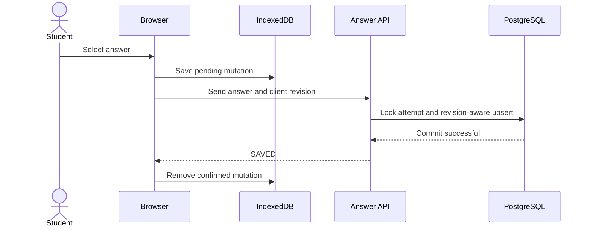

# OWASP TIET Quiz Portal — Backend

Production-oriented backend architecture for the OWASP TIET Quiz Portal. The system is intended to serve the current batch of approximately 3,000 students and to be stress-tested against an exam-style burst of 10,000 concurrent users.

> Status: architecture and design phase. Application code, database migrations, and infrastructure configuration have not been added yet.

## Design Documentation

- [High-level design](docs/hld.md)
- [Database design](docs/database-design.md)
- [API contract](docs/api-contract.md)
- [Engineering standards and CI/CD](docs/engineering.md)

## Goals

- Use managed services instead of maintaining custom infrastructure where practical.
- Keep the API stateless so it can scale horizontally.
- Protect accepted answers from loss during synchronized traffic spikes.
- Support offline answer recovery and idempotent synchronization.
- Keep PostgreSQL as the authoritative source of quiz data.
- Enforce quiz timing and authorization on the backend.
- Persist answers synchronously and process scoring and leaderboards asynchronously.
- Collect anti-cheating signals without continuously uploading camera footage.

## Target Architecture



### Managed services

| Concern | Service |
| --- | --- |
| Frontend | Next.js on Vercel |
| Backend API | Node.js, Express, and TypeScript on Railway |
| Authentication | Google OAuth through Supabase Auth |
| Primary database | Supabase PostgreSQL |
| Question media | Private Supabase Storage buckets |
| Cache and queues | Persistent managed Redis with BullMQ support |
| Background processing | A Railway worker service for scoring, expiry, and leaderboards |

The Railway and Supabase resources should be placed in the closest available common region. Redis must provide persistence, a `noeviction` policy, monitoring, and sufficient connection capacity for BullMQ.

## Authentication and Authorization



Supabase manages OAuth, sessions, refresh tokens, and JWT issuance. The backend validates token signature, issuer, audience, and expiry using Supabase JWKS. It does not implement a separate password or session system.

Version one uses two application roles:

- `student`: access assigned quizzes and their own attempts, answers, violations, and published results.
- `admin`: manage quizzes, questions, rosters, results, and violation reviews.

Students must appear in an imported quiz roster. A valid Google login alone does not grant quiz access. Administrative authorization is resolved from application data rather than trusting user-controlled token metadata.

## Quiz Rules

- Questions are single-choice MCQs with optional private images.
- Each question supports configurable positive and optional negative marks.
- Unanswered questions receive zero marks.
- A student receives one resumable attempt per quiz.
- Question and option order is randomized and snapshotted when the attempt starts.
- Published quiz content is immutable; later changes require a new draft/version.
- The backend creates `started_at` and `expires_at` timestamps using server time.
- Attempt expiry is the earlier of the configured duration and the quiz closing time.
- Results and correct answers remain hidden until an admin publishes them.

## Core Data Model

| Entity | Purpose |
| --- | --- |
| `profiles` | Supabase identity, normalized email, name, role, and account status |
| `quizzes` | Quiz configuration, schedule, duration, lifecycle, and result publication |
| `quiz_enrollments` | Imported roster entries and links to authenticated students |
| `questions` | Question content, optional media path, marks, and negative marks |
| `question_options` | Options, correctness, and source ordering |
| `attempts` | Student attempt state, timing, submission, and review status |
| `attempt_questions` | Immutable question and randomized option-order snapshot |
| `answers` | Latest persisted selection and monotonic revision per question |
| `violation_events` | Raw browser or ML telemetry received from the client |
| `violation_incidents` | Deduplicated events that count toward enforcement |
| `attempt_results` | Score, answer counts, rank, and scoring version |
| `audit_logs` | Security-sensitive administrative actions |

Important constraints include:

- One attempt per `(quiz_id, user_id)`.
- One answer per `(attempt_id, question_id)`.
- One enrollment per `(quiz_id, normalized_email)`.
- Revision-aware answer updates so an older offline request cannot overwrite a newer answer.

PostgreSQL is the source of truth and receives answer writes directly. Redis is limited to caching, rate limits, short-lived locks, and BullMQ jobs; it is not part of the answer durability path.

## Answer Saving and Offline Synchronization



The API acknowledges an answer only after PostgreSQL commits it. This keeps the durability guarantee simple: every answer reported as saved is already in the source-of-truth database.

Each answer request carries an idempotency key and a per-question client revision. Prisma handles normal validation and persistence, while a Prisma TypedSQL query performs `INSERT ... ON CONFLICT` and applies an update only when the incoming revision is newer. Requests use the database connection pool rather than opening a connection per student.

The frontend keeps unsaved answers in IndexedDB. After reconnection it sends them through a bounded batch synchronization endpoint in their original sequence. Duplicate and out-of-order requests remain safe because of the unique constraint, idempotency key, and revision check.

### Concurrent saves and query efficiency

- Answer save and submission lock the same student's attempt row, preventing a late answer from committing after submission.
- Conditional upserts accept only a higher client revision; the same revision with different content is rejected.
- API replicas use small connection pools, while the Supabase pooler controls how many queries reach PostgreSQL concurrently.
- Students update different attempt and answer rows, so synchronized saves do not create one shared row lock.
- Question, option, answer, roster, and leaderboard data must be fetched with joins or bounded batch queries; database calls inside unbounded loops are not allowed.
- Clicking Next changes the displayed question and does not send a second save when the selected answer is already saved or syncing.

### Submission

Submission is idempotent and database-backed:

1. Lock and validate the attempt in a short database transaction.
2. Mark it `SUBMITTED` and reject all later answer changes.
3. Enqueue scoring after the submission commit.
4. Let a recovery scan enqueue any submitted attempt that has no result, covering a temporary queue failure.
5. Generate leaderboard data as secondary background work.

The same process automatically submits an attempt when its backend-controlled expiry time is reached.

Queued answer persistence is intentionally excluded from version one. It will be reconsidered only if the 10,000-user load test proves that pooled, indexed PostgreSQL upserts cannot meet the latency target after query and database tuning.

## Anti-Cheating and Violation Enforcement

Camera analysis runs in the browser through MediaPipe or TensorFlow.js. Continuous video is never streamed to the backend. The client sends suspicious-event metadata such as detector version, event type, confidence, duration, and timestamps.

Potential signals include:

- No face or multiple faces.
- Sustained looking away or abnormal head movement.
- Tab visibility changes.
- Fullscreen exits.
- Copy or paste attempts.
- Other supported browser integrity signals.

Webcam ML cannot be guaranteed to be 100% accurate. Lighting, camera quality, accessibility requirements, occlusion, model bias, and modified clients can produce false results. Enforcement therefore uses configurable, calibrated, and reviewable incidents.

### Enforcement policy

- Qualifying incidents 1–3: display warnings.
- Incident 4: display a final warning.
- Incident 5: persist the violation, force-submit the attempt, block re-entry, and flag it for admin review.
- An admin makes the final validity or disqualification decision.

A browser-rule event may qualify directly. An ML event qualifies only when it satisfies the configured confidence and duration policy; the initial target is confidence of at least `0.95` sustained for at least three seconds. Repeated events of the same type are deduplicated within a configurable cooldown.

New or materially changed detectors must run in shadow mode and be evaluated for false positives before they can contribute to automatic removal. Enforcement remains feature-flagged by event type and all overrides are audited.

## API Overview

All endpoints are versioned under `/v1` and use standardized RFC 7807 problem responses.

### Student API

| Method | Endpoint | Purpose |
| --- | --- | --- |
| `GET` | `/v1/me` | Current profile and role |
| `GET` | `/v1/quizzes` | Assigned quizzes |
| `GET` | `/v1/quizzes/:quizId` | Quiz instructions and availability |
| `POST` | `/v1/quizzes/:quizId/attempts` | Start or resume the single attempt |
| `GET` | `/v1/attempts/:attemptId` | Attempt state and server timing |
| `GET` | `/v1/attempts/:attemptId/questions` | Attempt-specific question snapshot |
| `PUT` | `/v1/attempts/:attemptId/answers/:questionId` | Persist an answer revision |
| `POST` | `/v1/attempts/:attemptId/answers/sync` | Synchronize an offline answer batch |
| `POST` | `/v1/attempts/:attemptId/violations` | Record browser or ML events |
| `POST` | `/v1/attempts/:attemptId/submit` | Persist final submission state |
| `GET` | `/v1/attempts/:attemptId/result` | Read a published result |
| `GET` | `/v1/quizzes/:quizId/leaderboard` | Read a published leaderboard |

### Admin API

The admin API will provide:

- Draft quiz and question management.
- Scheduling, publishing, closing, and cloning quizzes.
- CSV roster import and enrollment management.
- Live attempt, worker, and submission summaries.
- Violation review and attempt validity decisions.
- Result and leaderboard generation and publication.

Private question images are delivered using short-lived signed URLs. Student APIs never return correct-option or hidden scoring fields.

## Planned Feature Structure

```text
prisma/
|-- schema.prisma
`-- migrations/

src/
|-- modules/
|   |-- auth/
|   |-- users/
|   |-- quizzes/
|   |-- attempts/
|   `-- violations/
|-- jobs/
|   |-- scoring/
|   |-- leaderboard/
|   `-- expiry/
|-- middleware/
|-- database/
|   |-- prisma.ts
|   `-- typed-sql/
|-- shared/
|   |-- config/
|   |-- errors/
|   |-- logging/
|   |-- redis/
|   |-- queue/
|   `-- security/
|-- app.ts
|-- server.ts
`-- worker.ts
```

Each module starts with `routes.ts`, `schema.ts`, `service.ts`, and tests. A `queries.ts` file is added only when the module needs custom Prisma or TypedSQL queries. Types are inferred from Zod and Prisma instead of duplicated manually. Admin endpoints live with the feature they manage rather than forming a separate domain module.

## Planned Technical Stack

- Express with strict TypeScript.
- Prisma Client for normal database access.
- Prisma Migrate with reviewed SQL migrations.
- Prisma TypedSQL for batched upserts, scoring, locking, and reporting queries.
- Zod validation with an OpenAPI 3.1 contract.
- BullMQ and `ioredis` for secondary background jobs only.
- `jose` for Supabase JWT verification.
- Pino structured logging.
- Vitest, Supertest, and Testcontainers for automated tests.
- k6 for exam-burst load testing.

The API and worker each create one reusable `PrismaClient` with deliberately small connection pools. Runtime traffic uses the Supabase pooled database URL, while migrations use a direct database URL. Prisma manages only application tables and must not modify Supabase-managed `auth` or `storage` schemas.

## Implementation Roadmap

1. Finalize the HLD, ERD, OpenAPI contract, threat model, and architecture decisions.
2. Add the project foundation, migrations, authentication, authorization, logging, and health checks.
3. Build one end-to-end slice: roster, quiz, attempt, direct answer persistence, submission, and scoring.
4. Run an early burst test and tune database indexes, queries, connection pools, and service replicas.
5. Add administration, private media, offline synchronization, violations, results, and leaderboards.
6. Add scoring recovery, expiry processing, auditing, observability, and operational runbooks.
7. Complete integration, security, failure-recovery, and final load testing.

## Performance Acceptance Targets

The principal load test models an exam rather than generic steady traffic:

- Ramp to 10,000 authenticated students.
- Create a synchronized attempt-start burst.
- Generate concurrent answer-save spikes and offline reconnection batches.
- Submit 10,000 attempts during a short closing window.
- Keep answer acceptance p95 below 300 ms under the agreed production test environment.
- Keep the answer API error rate below 0.1%.
- Lose zero answers that the API acknowledged as accepted.
- Keep database connection usage within configured pool limits during synchronized bursts.
- Drain scoring and leaderboard backlogs automatically without affecting answer-save latency.

Google OAuth itself is outside the backend load test. Tests use valid Supabase test identities so JWT verification and application authorization remain part of the exercised request path.

## Initial Non-Goals

- Custom password authentication or session storage.
- PostgreSQL read replicas before measured demand requires them.
- Continuous webcam upload or server-side video processing.
- Automatic permanent disqualification based solely on an ML prediction.
- Supporting free-text, numeric, or multi-select questions in the first release.
