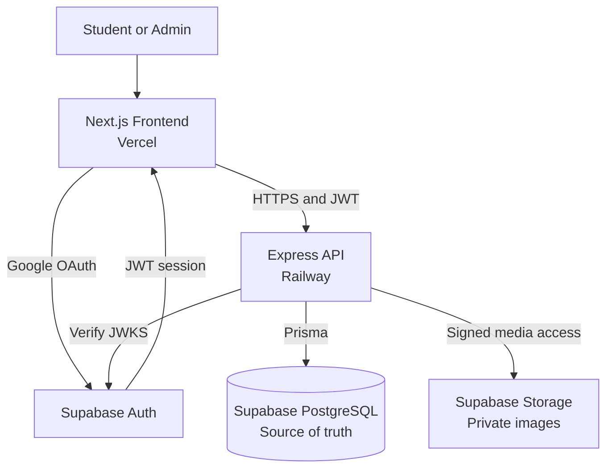
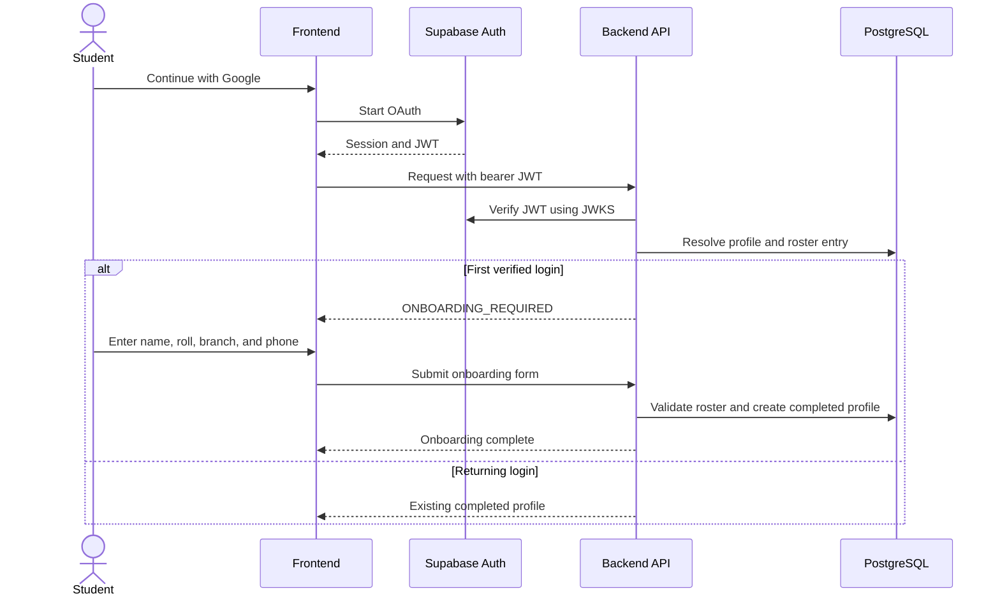
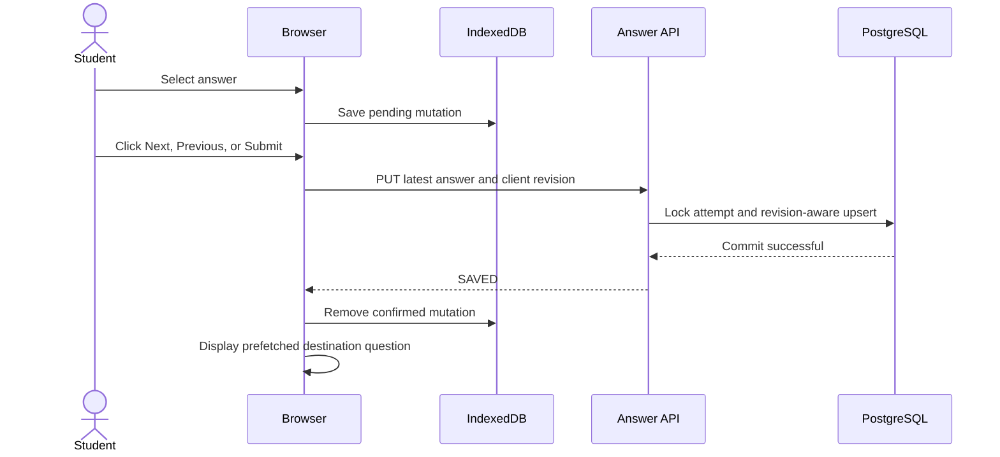

# OWASP TIET Quiz Portal — Backend

Production-oriented backend architecture for the OWASP TIET Quiz Portal. The system is intended to serve the current batch of approximately 3,000 students and to be stress-tested against an exam-style burst of 10,000 concurrent users.

> Status: the strict TypeScript/Express foundation and initial PostgreSQL/Prisma database layer are implemented. Authentication and quiz feature slices remain to be built in the documented order.

## Development

```text
pnpm install
Copy-Item .env.example .env
pnpm prisma:migrate:deploy
pnpm dev
```

Replace the placeholders in `.env` before running migrations. New developers should use an isolated local or development database, never production. Contributors who intentionally change `prisma/schema.prisma` create the next reviewed migration with `pnpm prisma:migrate:dev --name <change>`.

The foundation includes environment validation, request IDs, structured logging, Helmet, strict CORS, rate limiting, RFC 7807 errors, Prisma Client, and `/health/live` and `/health/ready`. Readiness returns `200` only when PostgreSQL accepts a lightweight query.

Run `pnpm prisma:validate`, `pnpm format:check`, `pnpm lint`, `pnpm typecheck`, `pnpm test:coverage`, and `pnpm build` before opening a pull request. CI runs the same checks, applies migrations to disposable PostgreSQL, and validates the OpenAPI contract.

## Design Documentation

- [Repository and AI contributor instructions](CLAUDE.md)
- [High-level design](docs/hld.md)
- [Database design](docs/database-design.md)
- [API contract](docs/api-contract.md)
- [Machine-readable OpenAPI contract](docs/openapi.yaml)
- [Engineering standards and CI/CD](docs/engineering.md)

## Goals

- Use managed services instead of maintaining custom infrastructure where practical.
- Keep the API stateless so it can scale horizontally.
- Group independently scheduled quizzes inside admin-managed quiz series.
- Protect accepted answers from loss during synchronized traffic spikes.
- Preserve unsaved answers locally and retry them safely after connectivity returns.
- Keep PostgreSQL as the authoritative source of quiz data.
- Enforce quiz timing and authorization on the backend.
- Persist answers and scores synchronously; calculate the leaderboard with a database query after quiz closure.
- Show a local live camera preview without recording, storing, analyzing, or uploading camera data.

## Target Architecture



### Managed services

| Concern | Service |
| --- | --- |
| Frontend | Next.js on Vercel |
| Backend API | Node.js, Express, and TypeScript on Railway |
| Authentication | Google OAuth through Supabase Auth |
| Primary database | Supabase PostgreSQL |
| Question media | Private Supabase Storage buckets |

The Railway API and Supabase project should be placed in the closest available common region. Redis, BullMQ, and a separate worker service are intentionally excluded from version one.

## Authentication and Authorization



Supabase manages Google OAuth, sessions, refresh tokens, and JWT issuance. The backend validates token signature, issuer, audience, and expiry using Supabase JWKS. It does not implement a separate password or session system.

Students do not type an email during signup. The email is read from the verified Google identity, normalized, checked against the configured TIET domains, and displayed as read-only during onboarding. The profile is linked to the Supabase user ID from the JWT rather than to an email string alone.

On the first verified login, the student completes a one-time form containing name, roll number, branch, and phone number. Roll number and branch are validated against the imported roster before `profile_completed_at` is set. Returning users must select the same Google account; another Google identity does not match the registered profile and receives `ACCOUNT_NOT_REGISTERED`.

Version one uses two application roles:

- `student`: access assigned quizzes and their own attempts, answers, violations, and published results.
- `admin`: manage quizzes, questions, rosters, results, and violation reviews.

Students must appear in an imported quiz roster and complete onboarding. A valid Google login alone does not grant quiz access. Administrative authorization is resolved from application data rather than trusting user-controlled token metadata.

## Quiz Rules

- A quiz series is an organizational parent containing one or more quizzes.
- Every quiz has its own schedule, duration, lifecycle, roster, attempts, and results.
- Questions are single-choice MCQs with optional private images.
- Students must complete their roster-validated profile before starting a quiz.
- Each question supports configurable positive and optional negative marks.
- Unanswered questions receive zero marks.
- A student receives one resumable attempt per quiz.
- Question and option order is randomized and snapshotted when the attempt starts.
- Published quiz content is immutable; later changes require a new draft/version.
- Admins can enable or disable a published quiz from the admin panel.
- Disabling blocks new attempts but does not interrupt students who already started.
- Closing a quiz is final, rejects further answers, and submits remaining active attempts.
- The backend creates `started_at` and `expires_at` timestamps using server time.
- Attempt expiry is the earlier of the configured duration and the quiz closing time.
- The frontend exits and submits when its server-synchronized timer reaches zero. The backend rejects all writes at or after `expires_at` even if the browser is disconnected.
- Results and correct answers remain hidden until an admin publishes them.

## Core Data Model

| Entity | Purpose |
| --- | --- |
| `quiz_series` | Admin-managed parent grouping for one or more independently scheduled quizzes |
| `profiles` | Supabase identity, verified email, name, roll number, branch, phone, role, status, and onboarding completion |
| `quizzes` | Quiz configuration, schedule, duration, admin availability toggle, lifecycle, and result publication |
| `quiz_enrollments` | Imported roster entries and links to authenticated students |
| `questions` | Question content, optional media path, marks, and negative marks |
| `question_options` | Options, correctness, and source ordering |
| `attempts` | Student attempt state, timing, submission, score totals, and review status |
| `attempt_questions` | Immutable question and randomized option-order snapshot |
| `answers` | Latest persisted selection and monotonic revision per question |
| `violations` | Browser events, qualification decision, and warning sequence |
| `attempt_reviews` | Append-only audit history for admin approval and disqualification decisions |

Important constraints include:

- One attempt per `(quiz_id, user_id)`.
- One answer per `(attempt_id, question_id)`.
- One enrollment per `(quiz_id, normalized_email)`.
- One completed profile per Supabase user ID and roll number.
- Revision-aware answer updates so an older offline request cannot overwrite a newer answer.

PostgreSQL is the source of truth and receives answer, submission, score, and violation writes directly.

## Question Delivery

The quiz ID is used only to start or resume an attempt. After that, the frontend uses the student-specific attempt ID:

```text
POST /v1/quizzes/:quizId/attempts
GET  /v1/attempts/:attemptId/questions/:displayOrder
```

The backend returns one randomized question at a time with its options and saved answer. The frontend may prefetch only the next question. Responses use `Cache-Control: no-store` and never include correctness or marks. A displayed question can still be inspected in browser tools, but future questions and the answer key remain server-side.

## Answer Saving and Local Recovery



Selecting or changing an option writes only to IndexedDB and sends no network request. When the student clicks Next, Previous, or Submit, the frontend sends the latest changed answer and waits for PostgreSQL confirmation before displaying an unseen question or completing submission. Unanswered and unchanged questions create no write.

Clearing a previously selected answer uses the same revision-safe PUT with `selectedOptionId: null`. The stored nullable selection acts as a tombstone so a delayed older request cannot restore the cleared answer.

Each answer request carries an idempotency key and a per-question client revision. Prisma handles validation and transactions; one small parameterized SQL helper performs `INSERT ... ON CONFLICT` and applies an update only when the incoming revision is newer. Requests use the database connection pool rather than opening a connection per student.

If saving fails, the frontend keeps the answer in IndexedDB, shows a retry state, and does not move to an unseen question. On reload or reconnection it restores the pending selection and retries the same PUT request. Duplicate and out-of-order retries remain safe because of the unique constraint, idempotency key, and revision check.

### Concurrent saves and query efficiency

- Answer save and submission lock the same student's attempt row, preventing a late answer from committing after submission.
- Conditional upserts accept only a higher client revision; the same revision with different content is rejected.
- API replicas use small connection pools, while the Supabase pooler controls how many queries reach PostgreSQL concurrently.
- Students update different attempt and answer rows, so synchronized saves do not create one shared row lock.
- Question, option, answer, roster, and leaderboard data must be fetched with joins or bounded batch queries; database calls inside unbounded loops are not allowed.
- Clicking Next or Previous sends one PUT only when the current answer changed; a successful save then allows navigation.

### Submission

Submission is idempotent and database-backed:

1. Lock and validate the attempt in a short database transaction.
2. Mark it `SUBMITTED` and reject all later answer changes.
3. Calculate the score from the attempt snapshot and saved answers.
4. Store score totals directly on the attempt.
5. Commit the submission and score together.

Every question/answer request enforces expiry. The API finalizes an expired attempt when it is next accessed, and admin quiz closure finalizes remaining expired attempts in database batches.

Expiry is logically effective at `expires_at`, not when finalization happens. The browser exits immediately using the synchronized server timer; a disconnected browser cannot extend the attempt because later writes are rejected.

Queues and background workers are intentionally excluded from version one. They will be reconsidered only if load testing proves the simple API/database path cannot meet the target.

## Camera and Violation Enforcement

The frontend requests video-only camera permission before the quiz begins and shows the student a muted live preview. The stream stays inside the browser: no recording is created, no frames or audio are stored, no ML runs, and no camera data or camera-derived metadata is sent to the backend. If permission is denied or the stream cannot start, the frontend blocks quiz start and shows a clear recovery message.

Backend violations are limited to ordinary browser events:

- Tab visibility changes.
- Fullscreen exits.
- Copy or paste attempts.
- Other explicitly configured browser integrity events.

### Enforcement policy

- Qualifying violations 1–3: display warnings.
- Incident 4: display a final warning.
- Incident 5: persist the violation, force-submit the attempt, block re-entry, and flag it for admin review.
- An admin makes the final validity or disqualification decision.

Repeated events of the same type are deduplicated within a configurable cooldown. Enforcement remains configurable by event type and all admin overrides are logged.

## API Overview

All endpoints are versioned under `/v1` and use standardized RFC 7807 problem responses.

### Student API

| Method | Endpoint | Purpose |
| --- | --- | --- |
| `GET` | `/v1/quiz-series` | Assigned quiz series |
| `GET` | `/v1/quiz-series/:seriesId/quizzes` | Assigned quizzes inside a series |
| `GET` | `/v1/me` | Current profile and role |
| `POST` | `/v1/onboarding` | Complete the first-login student profile |
| `GET` | `/v1/quizzes/:quizId` | Quiz instructions and availability |
| `POST` | `/v1/quizzes/:quizId/attempts` | Start or resume the single attempt |
| `GET` | `/v1/attempts/:attemptId` | Attempt state and server timing |
| `GET` | `/v1/attempts/:attemptId/questions/:displayOrder` | Current question and randomized options |
| `PUT` | `/v1/attempts/:attemptId/answers/:questionId` | Persist an answer revision |
| `POST` | `/v1/attempts/:attemptId/violations` | Record browser integrity events |
| `POST` | `/v1/attempts/:attemptId/submit` | Persist final submission state |
| `GET` | `/v1/attempts/:attemptId/result` | Read a published result |
| `GET` | `/v1/attempts/:attemptId/review` | Review answers after result publication |
| `GET` | `/v1/quizzes/:quizId/leaderboard` | Read a published leaderboard |

### Admin API

The admin API will provide:

- Draft quiz and question management.
- Scheduling, publishing, closing, and cloning quizzes.
- CSV roster import and enrollment management.
- Live attempt and submission summaries.
- Violation review and attempt validity decisions.
- Result and leaderboard generation and publication.

Private question images are delivered using short-lived signed URLs. Student APIs never return correct-option or hidden scoring fields.

## Planned Feature Structure

```text
.
|-- CLAUDE.md
|-- AGENTS.md
|-- README.md
|-- package.json
|-- pnpm-lock.yaml
|-- tsconfig.json
|-- .env.example
|-- docs/
|   |-- hld.md
|   |-- database-design.md
|   |-- api-contract.md
|   |-- openapi.yaml
|   `-- engineering.md
|-- prisma/
|   |-- schema.prisma
|   `-- migrations/
|-- src/
|   |-- modules/
|   |   |-- auth/
|   |   |   |-- middleware.ts
|   |   |   |-- service.ts
|   |   |   `-- service.test.ts
|   |   |-- users/
|   |   |   |-- routes.ts
|   |   |   |-- schema.ts
|   |   |   |-- service.ts
|   |   |   `-- service.test.ts
|   |   |-- quizzes/
|   |   |   |-- routes.ts
|   |   |   |-- schema.ts
|   |   |   |-- service.ts
|   |   |   `-- service.test.ts
|   |   |-- attempts/
|   |   |   |-- routes.ts
|   |   |   |-- schema.ts
|   |   |   |-- service.ts
|   |   |   |-- queries.ts
|   |   |   `-- service.test.ts
|   |   `-- violations/
|   |       |-- routes.ts
|   |       |-- schema.ts
|   |       |-- service.ts
|   |       `-- service.test.ts
|   |-- middleware/
|   |   |-- error-handler.ts
|   |   |-- not-found.ts
|   |   `-- request-id.ts
|   |-- lib/
|   |   |-- prisma.ts
|   |   `-- supabase.ts
|   |-- shared/
|   |   |-- config/
|   |   |   `-- env.ts
|   |   |-- errors/
|   |   |   `-- problem.ts
|   |   |-- logging/
|   |   |   `-- logger.ts
|   |   `-- security/
|   |       |-- cors.ts
|   |       `-- rate-limit.ts
|   |-- app.ts
|   `-- server.ts
|-- tests/
|   |-- integration/
|   `-- load/
|-- .github/
|   |-- workflows/
|   |   `-- ci.yml
|   |-- copilot-instructions.md
|   `-- pull_request_template.md
|-- .cursor/
|   `-- rules/
|       `-- repository.mdc
`-- .windsurfrules
```

This is the target structure, not permission to create empty placeholders. Add files as their vertical slice is implemented. Most HTTP modules use `routes.ts`, `schema.ts`, `service.ts`, and tests. `auth` uses middleware because Supabase owns login, and `attempts/queries.ts` contains the single revision-aware answer upsert. Types are inferred from Zod and Prisma instead of duplicated manually. Admin endpoints live with the feature they manage rather than forming a separate domain module.

## Planned Technical Stack

- Express with strict TypeScript.
- Prisma Client for normal database access.
- Prisma Migrate with reviewed SQL migrations.
- One parameterized SQL helper for the revision-aware answer upsert.
- Zod validation with an OpenAPI 3.1 contract.
- `jose` for Supabase JWT verification.
- Pino structured logging.
- Vitest, Supertest, and Testcontainers for automated tests.
- k6 for exam-burst load testing.

The API creates one reusable `PrismaClient` with a deliberately small connection pool. Runtime traffic uses the Supabase pooled database URL, while migrations use a direct database URL. Prisma manages only application tables and must not modify Supabase-managed `auth` or `storage` schemas.

## Implementation Roadmap

1. Finalize the HLD, ERD, OpenAPI contract, threat model, and architecture decisions.
2. Add the project foundation, migrations, authentication, authorization, logging, and health checks.
3. Build one end-to-end slice: roster, quiz, attempt, direct answer persistence, submission, and scoring.
4. Run an early burst test and tune database indexes, queries, connection pools, and service replicas.
5. Add administration, private media, local answer recovery, violations, results, and leaderboards.
6. Add expiry/finalization checks, logging, and operational runbooks.
7. Complete integration, security, failure-recovery, and final load testing.

## Performance Acceptance Targets

The principal load test models an exam rather than generic steady traffic:

- Ramp to 10,000 authenticated students.
- Create a synchronized attempt-start burst.
- Generate synchronized Next/save spikes and offline answer retries.
- Submit 10,000 attempts during a short closing window.
- Keep answer acceptance p95 below 300 ms under the agreed production test environment.
- Keep the answer API error rate below 0.1%.
- Lose zero answers that the API acknowledged as accepted.
- Keep database connection usage within configured pool limits during synchronized bursts.
- Keep synchronous submission and leaderboard queries within the measured performance targets.

Google OAuth itself is outside the backend load test. Tests use valid Supabase test identities so JWT verification and application authorization remain part of the exercised request path.

## Initial Non-Goals

- Custom password authentication or session storage.
- PostgreSQL read replicas before measured demand requires them.
- Redis, BullMQ, or a separate worker before measured demand requires them.
- Continuous webcam upload or server-side video processing.
- Browser-side ML or camera analysis.
- Supporting free-text, numeric, or multi-select questions in the first release.
