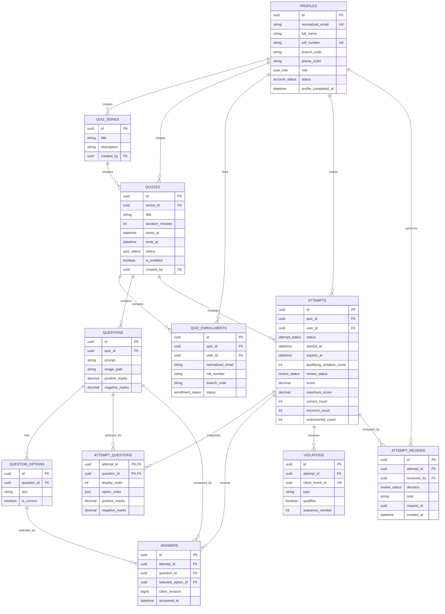

# Database Design

## Principles

- PostgreSQL is the authoritative store.
- Prisma manages application tables in the application schema only.
- Supabase-managed `auth` and `storage` schemas are not modified by Prisma.
- Runtime traffic uses the pooled connection URL; migrations use the direct URL.
- IDs use UUIDs and timestamps use timezone-aware PostgreSQL timestamps.
- Destructive cascades are avoided for exam records.

## Normalization and deliberate snapshots

The transactional model is normalized through fifth normal form where decomposition is useful:

- Every table has a declared primary key, and every non-key attribute depends on the whole candidate key.
- Repeating options, enrollments, answers, attempt questions, and violations are stored in separate relations rather than repeated columns.
- Many-to-many relationships are represented by `quiz_enrollments` and `attempt_questions`; there are no unresolved independent multivalued dependencies or join dependencies.
- Email normalization is represented once per identity context: `profiles` stores the verified application identity, while `quiz_enrollments` stores the imported roster identity that exists before a profile is linked.

Four structures are intentionally snapshotted, derived, or organizational rather than dynamically joined from mutable source rows:

- `quiz_enrollments` keeps imported email, roll number, branch, and roster name so eligibility remains auditable before and after account linking.
- `quiz_series` provides an organizational parent; child quizzes retain independent schedules and lifecycle state.
- `attempt_questions` keeps option order and marks as an immutable attempt-time snapshot, so later source changes cannot alter an active or submitted exam.
- `attempts` keeps final score and answer counts, written atomically at submission, so the published result is immutable and does not require repeated scoring queries.

These are controlled historical snapshots, not duplicate writable sources of truth. Source quiz content is immutable after publication, snapshot rows are never resynchronized, and submitted score fields are changed only by the documented submission/review workflow. The bounded `option_order` JSON array is the sole intentional non-scalar snapshot; it contains only option UUIDs, is validated for shape and uniqueness, and avoids an additional hot-path join table.

## Five mandatory SQL review gates

Every Prisma migration and custom SQL migration must pass all five gates before merge:

1. **Identity:** every table has the documented primary key, composite key, and candidate-key uniqueness constraints.
2. **References:** every relationship has a foreign key with an explicit delete policy; cross-question option selection is protected by a composite foreign key.
3. **Domain and state:** database `CHECK` constraints enforce ranges, timestamp ordering, normalized values, and nullability required by lifecycle state where PostgreSQL can express the rule locally.
4. **Normalization and redundancy:** new columns must depend on a key; snapshots or derived columns require a documented immutability or performance reason and one authoritative write path.
5. **Performance and concurrency:** unique constraints and foreign keys have supporting indexes, duplicate indexes are not created, hot queries stay within their query budgets, and race-sensitive writes use the documented constraints and row locks.

### Key matrix

| Table | Primary key | Composite/candidate keys |
| --- | --- | --- |
| `quiz_series` | `id` | None beyond the primary key |
| `profiles` | `id` | Unique `normalized_email`; partial unique `roll_number` when present |
| `quizzes` | `id` | None beyond the primary key |
| `quiz_enrollments` | `id` | Unique `(quiz_id, normalized_email)`, `(quiz_id, roll_number)`, and partial `(quiz_id, user_id)` |
| `questions` | `id` | Unique `(quiz_id, source_order)` |
| `question_options` | `id` | Unique `(question_id, id)` for composite references and `(question_id, source_order)` |
| `attempts` | `id` | Unique `(quiz_id, user_id)` |
| `attempt_questions` | `(attempt_id, question_id)` | Unique `(attempt_id, display_order)` |
| `answers` | `id` | Unique `(attempt_id, question_id)` |
| `violations` | `id` | Unique `(attempt_id, client_event_id)` and partial `(attempt_id, sequence_number)` |
| `attempt_reviews` | `id` | None beyond the primary key; append-only history |

## Entity relationship overview

## Enums

| Enum | Values |
| --- | --- |
| `user_role` | `STUDENT`, `ADMIN` |
| `account_status` | `ACTIVE`, `BLOCKED` |
| `quiz_status` | `DRAFT`, `PUBLISHED`, `CLOSED`, `RESULTS_PUBLISHED` |
| `enrollment_status` | `ELIGIBLE`, `REVOKED` |
| `attempt_status` | `IN_PROGRESS`, `SUBMITTED` |
| `submission_reason` | `USER`, `EXPIRED`, `VIOLATION`, `ADMIN` |
| `review_status` | `NOT_REQUIRED`, `PENDING`, `APPROVED`, `DISQUALIFIED` |

## Tables

### `quiz_series`

| Column | Type | Notes |
| --- | --- | --- |
| `id` | `uuid` | Primary key. |
| `title` | `text` | Required parent event/series name. |
| `description` | `text` | Nullable. |
| `created_by` | `uuid` | References the creating admin profile. |
| `created_at` | `timestamptz` | Creation time. |
| `updated_at` | `timestamptz` | Last update time. |

A series is an organizational container and does not replace child quiz timing. It may be deleted only when it contains no quizzes. Draft child quizzes must be deleted explicitly first; historical children keep the series retained.

### `profiles`

| Column | Type | Notes |
| --- | --- | --- |
| `id` | `uuid` | Primary key; equals the Supabase authenticated user ID. |
| `email` | `text` | Original authenticated email. |
| `normalized_email` | `text` | Lowercase and trimmed; unique. |
| `full_name` | `text` | Nullable until onboarding; then required. |
| `roll_number` | `text` | Nullable until onboarding; unique and roster-validated. |
| `branch_code` | `text` | Nullable until onboarding; roster-validated. |
| `phone_e164` | `text` | Nullable until onboarding; then required and stored in E.164 format. |
| `role` | `user_role` | Defaults to `STUDENT`. |
| `status` | `account_status` | Defaults to `ACTIVE`. |
| `profile_completed_at` | `timestamptz` | Nullable until the one-time onboarding transaction succeeds. |
| `created_at` | `timestamptz` | Creation time. |
| `updated_at` | `timestamptz` | Last update time. |

The Supabase user ID from the verified JWT is the identity source. Email is copied from the verified Google identity and is not accepted from onboarding input. The application profile stores authorization and onboarding data but does not duplicate passwords, access tokens, refresh tokens, or sessions.

Checks:

- `normalized_email = lower(btrim(email))` and both email values are non-empty.
- `profile_completed_at` is null only for an incomplete profile; a completed profile requires non-empty name, roll number, branch code, and E.164 phone number.
- `phone_e164` is null before onboarding or matches the E.164 shape after onboarding.

### `quizzes`

| Column | Type | Notes |
| --- | --- | --- |
| `id` | `uuid` | Primary key. |
| `series_id` | `uuid` | Required reference to `quiz_series.id`. |
| `title` | `text` | Required. |
| `description` | `text` | Nullable. |
| `instructions` | `text` | Nullable. |
| `duration_minutes` | `integer` | Positive value. |
| `starts_at` | `timestamptz` | Quiz access start. |
| `ends_at` | `timestamptz` | Must be after `starts_at`. |
| `status` | `quiz_status` | Defaults to `DRAFT`. |
| `is_enabled` | `boolean` | Defaults to false; controls whether a published quiz accepts new attempts. |
| `results_published_at` | `timestamptz` | Nullable. |
| `created_by` | `uuid` | References `profiles.id`. |
| `created_at` | `timestamptz` | Creation time. |
| `updated_at` | `timestamptz` | Last update time. |

Published quiz content is immutable. A changed quiz is created as a new draft or cloned version. `is_enabled` is an operational availability switch: disabling blocks new starts but does not change existing attempt expiry. Moving the quiz to `CLOSED` is the final action that ends active participation.

Checks:

- `duration_minutes > 0`.
- `ends_at > starts_at`.
- `results_published_at` is present if and only if status is `RESULTS_PUBLISHED`.
- Draft, closed, and results-published quizzes cannot remain enabled.

### `quiz_enrollments`

| Column | Type | Notes |
| --- | --- | --- |
| `id` | `uuid` | Primary key. |
| `quiz_id` | `uuid` | References `quizzes.id`. |
| `normalized_email` | `text` | Imported roster identity. |
| `user_id` | `uuid` | Nullable reference to `profiles.id`; linked after login. |
| `roll_number` | `text` | Required imported institutional roll number. |
| `branch_code` | `text` | Required imported branch code. |
| `roster_name` | `text` | Nullable imported student name for admin comparison. |
| `status` | `enrollment_status` | Defaults to `ELIGIBLE`. |
| `created_at` | `timestamptz` | Creation time. |

Unique constraints:

- `(quiz_id, normalized_email)`
- `(quiz_id, roll_number)`
- `(quiz_id, user_id)` when `user_id` is not null

During onboarding, the submitted roll number and branch must match the eligible roster row for the verified Google email. Conflicting roster information is rejected for admin review rather than silently overwriting an existing profile.

Checks require a normalized, non-empty email, roll number, and branch code. A linked `user_id` must remain unique within the quiz.

### `questions`

| Column | Type | Notes |
| --- | --- | --- |
| `id` | `uuid` | Primary key. |
| `quiz_id` | `uuid` | References `quizzes.id`. |
| `prompt` | `text` | Required question text. |
| `image_path` | `text` | Nullable private Supabase Storage path. |
| `positive_marks` | `numeric(8,2)` | Must be non-negative. |
| `negative_marks` | `numeric(8,2)` | Must be non-negative; zero disables negative marking. |
| `source_order` | `integer` | Admin ordering before randomization. |
| `created_at` | `timestamptz` | Creation time. |
| `updated_at` | `timestamptz` | Last update time. |

Constraints:

- Unique `(quiz_id, source_order)`.
- `source_order >= 1`.
- `positive_marks >= 0` and `negative_marks >= 0`.

### `question_options`

| Column | Type | Notes |
| --- | --- | --- |
| `id` | `uuid` | Primary key. |
| `question_id` | `uuid` | References `questions.id`. |
| `text` | `text` | Required unless an option image is supported later. |
| `is_correct` | `boolean` | Hidden from student APIs. |
| `source_order` | `integer` | Admin ordering before randomization. |
| `created_at` | `timestamptz` | Creation time. |

Constraints:

- Unique `(question_id, id)` to support composite answer integrity.
- Unique `(question_id, source_order)`.
- Partial unique index on `question_id` where `is_correct = true` to allow at most one correct option.
- Publication validation requires exactly one correct option and at least two options.
- `source_order >= 1` and option text is non-empty.

### `attempts`

| Column | Type | Notes |
| --- | --- | --- |
| `id` | `uuid` | Primary key. |
| `quiz_id` | `uuid` | References `quizzes.id`. |
| `user_id` | `uuid` | References `profiles.id`. |
| `status` | `attempt_status` | Defaults to `IN_PROGRESS`. |
| `started_at` | `timestamptz` | Set by the backend. |
| `expires_at` | `timestamptz` | Set by the backend. |
| `submitted_at` | `timestamptz` | Nullable. |
| `submission_reason` | `submission_reason` | Nullable until submission. |
| `qualifying_violation_count` | `integer` | Defaults to zero. |
| `review_status` | `review_status` | Defaults to `NOT_REQUIRED`. |
| `score` | `numeric(10,2)` | Nullable until submission. |
| `maximum_score` | `numeric(10,2)` | Nullable until submission. |
| `correct_count` | `integer` | Nullable until submission. |
| `incorrect_count` | `integer` | Nullable until submission. |
| `unanswered_count` | `integer` | Nullable until submission. |
| `scored_at` | `timestamptz` | Nullable until submission scoring completes. |
| `created_at` | `timestamptz` | Creation time. |
| `updated_at` | `timestamptz` | Last update time. |

Unique constraint: `(quiz_id, user_id)`.

Checks:

- `expires_at >= started_at` and `qualifying_violation_count >= 0`.
- `IN_PROGRESS` attempts have no submission, score, or answer-count fields.
- `SUBMITTED` attempts require `submitted_at`, `submission_reason`, `scored_at`, score totals, and non-negative answer counts.
- `maximum_score >= 0`; the final `score` may be negative because negative marking is supported.

### `attempt_questions`

| Column | Type | Notes |
| --- | --- | --- |
| `attempt_id` | `uuid` | References `attempts.id`. |
| `question_id` | `uuid` | References `questions.id`. |
| `display_order` | `integer` | Randomized question position. |
| `option_order` | `jsonb` | Ordered array of option UUIDs. |
| `positive_marks` | `numeric(8,2)` | Snapshot at attempt creation. |
| `negative_marks` | `numeric(8,2)` | Snapshot at attempt creation. |

Primary key: `(attempt_id, question_id)`. Display order is unique per attempt.

Checks require `display_order >= 1`, non-negative snapshotted marks, and a JSON array containing at least two unique option UUIDs. Attempt creation validates that every UUID belongs to the snapshotted question.

### `answers`

| Column | Type | Notes |
| --- | --- | --- |
| `id` | `uuid` | Primary key. |
| `attempt_id` | `uuid` | References `attempts.id`. |
| `question_id` | `uuid` | References `questions.id`. |
| `selected_option_id` | `uuid` | Nullable reference to an option belonging to the same question; null records an explicit cleared-answer tombstone. |
| `client_revision` | `bigint` | Monotonically increases per question. |
| `last_idempotency_key` | `uuid` | Last accepted client mutation key. |
| `answered_at` | `timestamptz` | Server acceptance time. |
| `updated_at` | `timestamptz` | Last update time. |

Constraints:

- Unique `(attempt_id, question_id)`.
- Foreign key `(attempt_id, question_id)` to `attempt_questions`.
- Foreign key `(question_id, selected_option_id)` to `question_options(question_id, id)`.
- Upserts update only when the incoming `client_revision` is greater.
- `client_revision >= 1`.

A row with `selected_option_id = null` is not counted as answered during scoring. Keeping the row and higher revision prevents delayed requests from restoring an older selection.

### `violations`

| Column | Type | Notes |
| --- | --- | --- |
| `id` | `uuid` | Primary key. |
| `attempt_id` | `uuid` | References `attempts.id`. |
| `client_event_id` | `uuid` | Client-generated event ID; unique per attempt. |
| `type` | `text` | Stable browser-event identifier. |
| `client_occurred_at` | `timestamptz` | Client-reported event time. |
| `received_at` | `timestamptz` | Server time. |
| `metadata` | `jsonb` | Validated, size-limited metadata. |
| `qualifies` | `boolean` | Whether this event counts toward enforcement. |
| `sequence_number` | `integer` | Nullable warning/removal count. |

Unique constraints: `(attempt_id, client_event_id)` and `(attempt_id, sequence_number)` when `sequence_number` is not null.

Checks require a non-empty event type, `sequence_number >= 1` when present, and object-shaped JSON metadata. Request validation enforces the configured metadata byte limit. A qualifying event receives a sequence number in the same transaction that increments the attempt count.

### `attempt_reviews`

| Column | Type | Notes |
| --- | --- | --- |
| `id` | `uuid` | Primary key. |
| `attempt_id` | `uuid` | References `attempts.id`. |
| `reviewed_by` | `uuid` | References the acting admin `profiles.id`. |
| `decision` | `review_status` | Only `APPROVED` or `DISQUALIFIED`. |
| `note` | `text` | Nullable bounded admin explanation. |
| `request_id` | `uuid` | Request correlation identifier. |
| `created_at` | `timestamptz` | Immutable server timestamp. |

Review rows are append-only. The current decision remains on `attempts.review_status` for efficient authorization, while this table is the authoritative audit history of who changed it and why.

## Foreign-key delete policy

- Historical profiles, quizzes, enrollments, attempts, snapshots, answers, and violations use `ON DELETE RESTRICT`/`NO ACTION`; exam records are never removed by a parent cascade.
- Historical quiz series and attempt reviews also use `ON DELETE RESTRICT`/`NO ACTION`.
- Draft question deletion explicitly removes its options and then the question in one transaction. It is rejected once an attempt snapshot references the question or an answer references an option.
- Account blocking, enrollment revocation, quiz closure, and attempt disqualification are state transitions, not deletes.
- Foreign-key columns are indexed by a unique/composite constraint or by an additional index listed below.

## Required indexes

Constraint-backed indexes must be reused rather than duplicated:

- Unique `profiles(normalized_email)` and partial unique `profiles(roll_number)` where not null.
- Unique enrollment keys `(quiz_id, normalized_email)`, `(quiz_id, roll_number)`, and partial `(quiz_id, user_id)` where linked.
- Unique source ordering `(quiz_id, source_order)` for questions and `(question_id, source_order)` for options.
- Unique attempt and snapshot keys `(quiz_id, user_id)`, `(attempt_id, question_id)`, and `(attempt_id, display_order)`.
- Unique answer key `(attempt_id, question_id)` and violation keys `(attempt_id, client_event_id)` and partial `(attempt_id, sequence_number)`.

Additional non-unique indexes:

- `quizzes(status, starts_at, ends_at)`.
- `quiz_series(created_by)`.
- `quizzes(series_id, starts_at)`.
- `quizzes(created_by)`.
- `quiz_enrollments(normalized_email, status)`.
- `quiz_enrollments(user_id)` where linked.
- `attempts(user_id, status)`.
- `attempts(quiz_id, status)`.
- `attempts(status, expires_at)` for expiry scans.
- `attempt_questions(question_id)`.
- `answers(question_id, selected_option_id)`.
- `violations(attempt_id, received_at, id)` for stable cursor pagination.
- `attempt_reviews(attempt_id, created_at, id)` for stable audit history.

Do not add a separate `answers(attempt_id)` or `violations(attempt_id, sequence_number)` index because the leading columns of the documented unique indexes already serve those access paths. Indexes must be confirmed with query plans after realistic load tests; speculative or overlapping indexes are avoided.

## Transaction boundaries

### First-login onboarding

- Lock the eligible roster entry for the verified Google email.
- Confirm the submitted roll number and branch match the roster.
- Confirm the roll number is not linked to another Supabase user ID.
- Update the profile fields and `profile_completed_at`.
- Link every applicable enrollment for the same verified email to the profile.
- Commit together; duplicate or conflicting identities fail without partial profile creation.

### Attempt creation

- Validate eligibility and schedule.
- Select only published questions belonging to the attempt's quiz and validate every snapshotted option belongs to its question.
- Insert the attempt.
- Insert randomized `attempt_questions`.
- Commit together.

### Answer save

- Lock the attempt row.
- Validate attempt ownership, state, and expiry under the lock.
- Execute one revision-aware upsert.
- Commit before returning success.

### Submission

- Lock the attempt row.
- Read the attempt snapshot and saved answers.
- Calculate score and answer counts.
- Store submission and score fields on the attempt.
- Commit together.

### Qualifying violation

- Insert the deduplicated violation row.
- Lock and increment the attempt counter.
- Calculate and store the score when the count reaches five and force submission.
- Commit as one unit.

### Attempt review

- Lock the attempt row.
- Validate the acting application admin and requested decision.
- Append one immutable `attempt_reviews` row with the request ID.
- Update `attempts.review_status`.
- Commit together.

## Concurrency invariants

- Attempt creation relies on the unique `(quiz_id, user_id)` constraint rather than a read-then-insert assumption.
- Onboarding relies on unique profile email/roll constraints so concurrent or repeated form submissions cannot create two student identities.
- Answer save, submission, expiry, and qualifying-violation transitions lock the same attempt row.
- The answer upsert updates only when the incoming revision is higher.
- Selected and cleared answers share the same revision ordering.
- The same revision with different content is rejected instead of choosing an arbitrary winner.
- Submitted attempts already contain their score, making repeated submission idempotent.
- Unique violation event and sequence constraints prevent duplicate violation counts.
- PostgreSQL's normal `READ COMMITTED` isolation plus explicit row locks is sufficient initially; stronger isolation is added only if testing exposes an invariant that needs it.

## Query patterns and N+1 prevention

- Assigned child quizzes: query eligible enrollments joined to quiz summaries and filter by series; do not query each quiz separately.
- Current question: fetch one `attempt_questions` row joined to its question, ordered options, and saved answer.
- Scoring: use one set-based query over attempt questions, options, and answers.
- Leaderboard: use one aggregate/window query after quiz closure.
- Admin summaries: use grouped counts rather than loading attempts and counting in application memory.
- Violation history: paginate by `(received_at, id)`.
- Inspect `EXPLAIN (ANALYZE, BUFFERS)` output for hot queries during staging load tests.

No service may execute a database call inside a loop over an unbounded result set.

## Migration policy

- Use Prisma Migrate and commit generated SQL.
- Review every migration before merge.
- Use custom SQL inside migrations for partial indexes and advanced constraints.
- Apply migrations to staging before production.
- Prefer backward-compatible expand-and-contract changes.
- Never use `prisma db push` against staging or production.
- Roll back application releases by redeployment; repair database changes with a reviewed forward migration.

## Data retention

Retention periods must be approved before production. Until then:

- Keep attempts, answers, and scores according to institutional policy.
- Restrict phone-number access to the student and authorized admins; never include it in logs, exports, results, or leaderboards unless explicitly approved.
- Keep violation metadata only as long as required for review and institutional policy.
- Do not store camera video, frames, audio, camera-derived metadata, or ML output.
- Remove signed media URLs from logs; store only stable private object paths.
