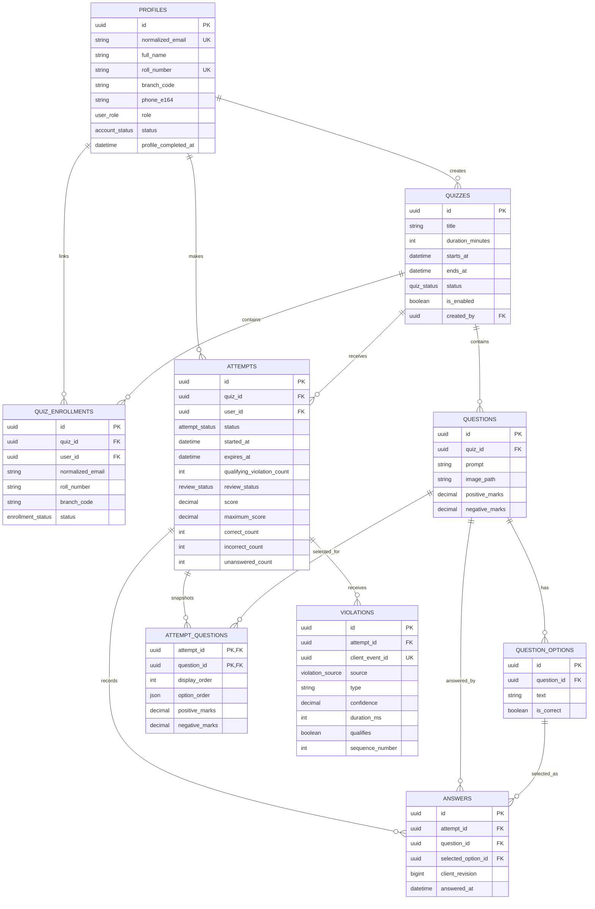

# Database Design

## Principles

- PostgreSQL is the authoritative store.
- Prisma manages application tables in the application schema only.
- Supabase-managed `auth` and `storage` schemas are not modified by Prisma.
- Runtime traffic uses the pooled connection URL; migrations use the direct URL.
- IDs use UUIDs and timestamps use timezone-aware PostgreSQL timestamps.
- Destructive cascades are avoided for exam records.

## Entity relationship overview

## Enums

| Enum | Values |
| --- | --- |
| `user_role` | `STUDENT`, `ADMIN` |
| `account_status` | `ACTIVE`, `BLOCKED` |
| `quiz_status` | `DRAFT`, `PUBLISHED`, `CLOSED`, `RESULTS_PUBLISHED` |
| `enrollment_status` | `ELIGIBLE`, `REVOKED` |
| `attempt_status` | `IN_PROGRESS`, `SUBMITTED` |
| `submission_reason` | `USER`, `EXPIRED`, `VIOLATION`, `ADMIN` |
| `review_status` | `NOT_REQUIRED`, `PENDING`, `APPROVED`, `DISQUALIFIED` |
| `violation_source` | `BROWSER`, `ML` |

## Tables

### `profiles`

| Column | Type | Notes |
| --- | --- | --- |
| `id` | `uuid` | Primary key; equals the Supabase authenticated user ID. |
| `email` | `text` | Original authenticated email. |
| `normalized_email` | `text` | Lowercase and trimmed; unique. |
| `full_name` | `text` | Nullable until onboarding; then required. |
| `roll_number` | `text` | Nullable until onboarding; unique and roster-validated. |
| `branch_code` | `text` | Nullable until onboarding; roster-validated. |
| `phone_e164` | `text` | Nullable until onboarding; then required and stored in E.164 format. |
| `role` | `user_role` | Defaults to `STUDENT`. |
| `status` | `account_status` | Defaults to `ACTIVE`. |
| `profile_completed_at` | `timestamptz` | Nullable until the one-time onboarding transaction succeeds. |
| `created_at` | `timestamptz` | Creation time. |
| `updated_at` | `timestamptz` | Last update time. |

The Supabase user ID from the verified JWT is the identity source. Email is copied from the verified Google identity and is not accepted from onboarding input. The application profile stores authorization and onboarding data but does not duplicate passwords, access tokens, refresh tokens, or sessions.

### `quizzes`

| Column | Type | Notes |
| --- | --- | --- |
| `id` | `uuid` | Primary key. |
| `title` | `text` | Required. |
| `description` | `text` | Nullable. |
| `instructions` | `text` | Nullable. |
| `duration_minutes` | `integer` | Positive value. |
| `starts_at` | `timestamptz` | Quiz access start. |
| `ends_at` | `timestamptz` | Must be after `starts_at`. |
| `status` | `quiz_status` | Defaults to `DRAFT`. |
| `is_enabled` | `boolean` | Defaults to false; controls whether a published quiz accepts new attempts. |
| `results_published_at` | `timestamptz` | Nullable. |
| `created_by` | `uuid` | References `profiles.id`. |
| `created_at` | `timestamptz` | Creation time. |
| `updated_at` | `timestamptz` | Last update time. |

Published quiz content is immutable. A changed quiz is created as a new draft or cloned version. `is_enabled` is an operational availability switch: disabling blocks new starts but does not change existing attempt expiry. Moving the quiz to `CLOSED` is the final action that ends active participation.

### `quiz_enrollments`

| Column | Type | Notes |
| --- | --- | --- |
| `id` | `uuid` | Primary key. |
| `quiz_id` | `uuid` | References `quizzes.id`. |
| `normalized_email` | `text` | Imported roster identity. |
| `user_id` | `uuid` | Nullable reference to `profiles.id`; linked after login. |
| `roll_number` | `text` | Required imported institutional roll number. |
| `branch_code` | `text` | Required imported branch code. |
| `roster_name` | `text` | Nullable imported student name for admin comparison. |
| `status` | `enrollment_status` | Defaults to `ELIGIBLE`. |
| `created_at` | `timestamptz` | Creation time. |

Unique constraints:

- `(quiz_id, normalized_email)`
- `(quiz_id, roll_number)`
- `(quiz_id, user_id)` when `user_id` is not null

During onboarding, the submitted roll number and branch must match the eligible roster row for the verified Google email. Conflicting roster information is rejected for admin review rather than silently overwriting an existing profile.

### `questions`

| Column | Type | Notes |
| --- | --- | --- |
| `id` | `uuid` | Primary key. |
| `quiz_id` | `uuid` | References `quizzes.id`. |
| `prompt` | `text` | Required question text. |
| `image_path` | `text` | Nullable private Supabase Storage path. |
| `positive_marks` | `numeric(8,2)` | Must be non-negative. |
| `negative_marks` | `numeric(8,2)` | Must be non-negative; zero disables negative marking. |
| `source_order` | `integer` | Admin ordering before randomization. |
| `created_at` | `timestamptz` | Creation time. |
| `updated_at` | `timestamptz` | Last update time. |

### `question_options`

| Column | Type | Notes |
| --- | --- | --- |
| `id` | `uuid` | Primary key. |
| `question_id` | `uuid` | References `questions.id`. |
| `text` | `text` | Required unless an option image is supported later. |
| `is_correct` | `boolean` | Hidden from student APIs. |
| `source_order` | `integer` | Admin ordering before randomization. |
| `created_at` | `timestamptz` | Creation time. |

Constraints:

- Unique `(question_id, id)` to support composite answer integrity.
- Partial unique index on `question_id` where `is_correct = true` to allow at most one correct option.
- Publication validation requires exactly one correct option and at least two options.

### `attempts`

| Column | Type | Notes |
| --- | --- | --- |
| `id` | `uuid` | Primary key. |
| `quiz_id` | `uuid` | References `quizzes.id`. |
| `user_id` | `uuid` | References `profiles.id`. |
| `status` | `attempt_status` | Defaults to `IN_PROGRESS`. |
| `started_at` | `timestamptz` | Set by the backend. |
| `expires_at` | `timestamptz` | Set by the backend. |
| `submitted_at` | `timestamptz` | Nullable. |
| `submission_reason` | `submission_reason` | Nullable until submission. |
| `qualifying_violation_count` | `integer` | Defaults to zero. |
| `review_status` | `review_status` | Defaults to `NOT_REQUIRED`. |
| `score` | `numeric(10,2)` | Nullable until submission. |
| `maximum_score` | `numeric(10,2)` | Nullable until submission. |
| `correct_count` | `integer` | Nullable until submission. |
| `incorrect_count` | `integer` | Nullable until submission. |
| `unanswered_count` | `integer` | Nullable until submission. |
| `scored_at` | `timestamptz` | Nullable until submission scoring completes. |
| `created_at` | `timestamptz` | Creation time. |
| `updated_at` | `timestamptz` | Last update time. |

Unique constraint: `(quiz_id, user_id)`.

### `attempt_questions`

| Column | Type | Notes |
| --- | --- | --- |
| `attempt_id` | `uuid` | References `attempts.id`. |
| `question_id` | `uuid` | References `questions.id`. |
| `display_order` | `integer` | Randomized question position. |
| `option_order` | `jsonb` | Ordered array of option UUIDs. |
| `positive_marks` | `numeric(8,2)` | Snapshot at attempt creation. |
| `negative_marks` | `numeric(8,2)` | Snapshot at attempt creation. |

Primary key: `(attempt_id, question_id)`. Display order is unique per attempt.

### `answers`

| Column | Type | Notes |
| --- | --- | --- |
| `id` | `uuid` | Primary key. |
| `attempt_id` | `uuid` | References `attempts.id`. |
| `question_id` | `uuid` | References `questions.id`. |
| `selected_option_id` | `uuid` | References an option belonging to the same question. |
| `client_revision` | `bigint` | Monotonically increases per question. |
| `last_idempotency_key` | `text` | Last accepted client mutation key. |
| `answered_at` | `timestamptz` | Server acceptance time. |
| `updated_at` | `timestamptz` | Last update time. |

Constraints:

- Unique `(attempt_id, question_id)`.
- Foreign key `(attempt_id, question_id)` to `attempt_questions`.
- Foreign key `(question_id, selected_option_id)` to `question_options(question_id, id)`.
- Upserts update only when the incoming `client_revision` is greater.

### `violations`

| Column | Type | Notes |
| --- | --- | --- |
| `id` | `uuid` | Primary key. |
| `attempt_id` | `uuid` | References `attempts.id`. |
| `client_event_id` | `uuid` | Client-generated event ID; unique per attempt. |
| `source` | `violation_source` | Browser rule or ML. |
| `type` | `text` | Stable event identifier. |
| `confidence` | `numeric(5,4)` | Nullable for browser events. |
| `duration_ms` | `integer` | Nullable. |
| `detector_version` | `text` | Nullable for browser events. |
| `client_occurred_at` | `timestamptz` | Client-reported event time. |
| `received_at` | `timestamptz` | Server time. |
| `metadata` | `jsonb` | Validated, size-limited metadata. |
| `qualifies` | `boolean` | Whether this event counts toward enforcement. |
| `sequence_number` | `integer` | Nullable warning/removal count. |

Unique constraints: `(attempt_id, client_event_id)` and `(attempt_id, sequence_number)` when `sequence_number` is not null.

## Required indexes

- `profiles(normalized_email)` unique.
- `profiles(roll_number)` unique where not null.
- `quizzes(status, starts_at, ends_at)`.
- `quiz_enrollments(normalized_email, status)`.
- `quiz_enrollments(quiz_id, user_id)`.
- `quiz_enrollments(quiz_id, roll_number)` unique.
- `questions(quiz_id, source_order)`.
- `attempts(user_id, status)`.
- `attempts(quiz_id, status)`.
- `attempts(status, expires_at)` for expiry scans.
- `answers(attempt_id)`.
- `violations(attempt_id, received_at)`.
- `violations(attempt_id, sequence_number)`.

Indexes should be confirmed with query plans after realistic load tests; speculative indexes are avoided.

## Transaction boundaries

### First-login onboarding

- Lock the eligible roster entry for the verified Google email.
- Confirm the submitted roll number and branch match the roster.
- Confirm the roll number is not linked to another Supabase user ID.
- Update the profile fields and `profile_completed_at`.
- Link every applicable enrollment for the same verified email to the profile.
- Commit together; duplicate or conflicting identities fail without partial profile creation.

### Attempt creation

- Validate eligibility and schedule.
- Insert the attempt.
- Insert randomized `attempt_questions`.
- Commit together.

### Answer save

- Lock the attempt row.
- Validate attempt ownership, state, and expiry under the lock.
- Execute one revision-aware upsert.
- Commit before returning success.

### Submission

- Lock the attempt row.
- Read the attempt snapshot and saved answers.
- Calculate score and answer counts.
- Store submission and score fields on the attempt.
- Commit together.

### Qualifying violation

- Insert the deduplicated violation row.
- Lock and increment the attempt counter.
- Calculate and store the score when the count reaches five and force submission.
- Commit as one unit.

## Concurrency invariants

- Attempt creation relies on the unique `(quiz_id, user_id)` constraint rather than a read-then-insert assumption.
- Onboarding relies on unique profile email/roll constraints so concurrent or repeated form submissions cannot create two student identities.
- Answer save, submission, expiry, and qualifying-violation transitions lock the same attempt row.
- The answer upsert updates only when the incoming revision is higher.
- The same revision with different content is rejected instead of choosing an arbitrary winner.
- Submitted attempts already contain their score, making repeated submission idempotent.
- Unique violation event and sequence constraints prevent duplicate violation counts.
- PostgreSQL's normal `READ COMMITTED` isolation plus explicit row locks is sufficient initially; stronger isolation is added only if testing exposes an invariant that needs it.

## Query patterns and N+1 prevention

- Assigned quizzes: query eligible enrollments joined to quiz summaries; do not query each quiz separately.
- Current question: fetch one `attempt_questions` row joined to its question, ordered options, and saved answer.
- Scoring: use one set-based query over attempt questions, options, and answers.
- Leaderboard: use one aggregate/window query after quiz closure.
- Admin summaries: use grouped counts rather than loading attempts and counting in application memory.
- Violation history: paginate by `(received_at, id)`.
- Inspect `EXPLAIN (ANALYZE, BUFFERS)` output for hot queries during staging load tests.

No service may execute a database call inside a loop over an unbounded result set.

## Migration policy

- Use Prisma Migrate and commit generated SQL.
- Review every migration before merge.
- Use custom SQL inside migrations for partial indexes and advanced constraints.
- Apply migrations to staging before production.
- Prefer backward-compatible expand-and-contract changes.
- Never use `prisma db push` against staging or production.
- Roll back application releases by redeployment; repair database changes with a reviewed forward migration.

## Data retention

Retention periods must be approved before production. Until then:

- Keep attempts, answers, and scores according to institutional policy.
- Restrict phone-number access to the student and authorized admins; never include it in logs, exports, results, or leaderboards unless explicitly approved.
- Keep violation metadata only as long as required for review and institutional policy.
- Do not store camera video.
- Remove signed media URLs from logs; store only stable private object paths.
