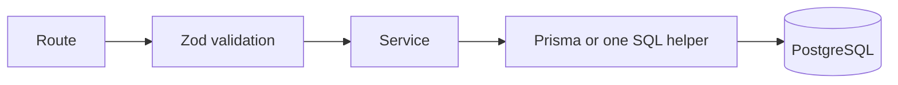
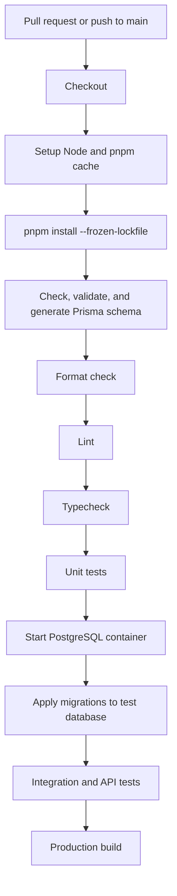
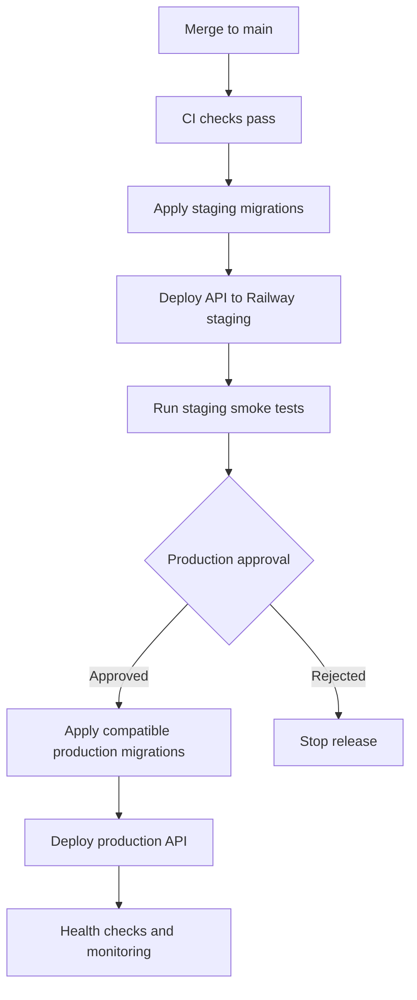

# Engineering Standards and CI/CD

## Goal

Keep development predictable and production-safe without adding process that does not improve the quiz system. The default is a small set of automated checks, short-lived branches, and one repeatable deployment path.

## Stack

- Node.js LTS and `pnpm`.
- Express with strict TypeScript.
- Prisma Client and Prisma Migrate.
- Zod for input and environment validation.
- Pino for structured logs.
- Vitest, Supertest, Testcontainers, and k6.
- GitHub Actions for CI/CD.
- Railway for API deployment.
- Supabase for Auth, PostgreSQL, and Storage.

## Module rules



- Routes define middleware, validation, and HTTP mapping.
- Services enforce authorization, lifecycle, and transaction rules.
- Normal database calls may live in the service; move complex or reusable SQL into `queries.ts`.
- Do not add controller classes, generic repositories, or dependency-injection containers by default.
- Validation schemas live next to their feature.
- Types are inferred from Zod and Prisma unless a separate domain type adds real value.
- A module may call another module's exported service function, but must not reach into its private files.
- Shared code must be genuinely cross-cutting; avoid generic helper dumping grounds.

Default module shape:

```text
module/
|-- routes.ts
|-- schema.ts
|-- service.ts
|-- queries.ts       # optional
`-- service.test.ts
```

Initial modules:

- `auth`
- `users`
- `quizzes`
- `attempts`
- `violations`

Admin routes live in the module responsible for the underlying feature.

## TypeScript and formatting

- Enable TypeScript strict mode.
- Do not use `any`; use `unknown` and narrow it.
- Prefer explicit public function return types.
- Do not use non-null assertions without a documented invariant.
- Keep domain enums aligned with Prisma enums and API schemas.
- Use ESLint for correctness and Prettier for formatting.
- CI, not developer-specific editor settings, is the final formatting authority.
- Use path aliases only for stable top-level boundaries.

## Validation and errors

- Validate environment variables during process startup.
- Validate all path, query, header, and body inputs with Zod.
- Convert application errors to RFC 7807 responses in one error middleware.
- Use stable machine-readable error codes.
- Do not expose stack traces, SQL, internal IDs, or dependency details to clients.
- Treat expected state conflicts as typed domain errors, not generic exceptions.

## Prisma and SQL rules

- Create one reusable `PrismaClient` per API process.
- Never create a Prisma client per request.
- Use Prisma Client for normal CRUD and relations.
- Keep one parameterized SQL helper for the revision-aware answer upsert; use Prisma for everything else initially.
- Keep transactions short and avoid network calls inside them.
- Select only required columns on hot paths.
- Paginate unbounded admin lists.
- Review generated migration SQL before merge.
- Never run `prisma db push` in staging or production.
- Do not let Prisma modify Supabase `auth` or `storage` schemas.

### Avoiding N+1 queries

- Never call Prisma inside a loop over quizzes, questions, attempts, or students.
- Fetch required relations with a bounded `select`/`include` or batched `IN` query.
- Fetch one requested question, its options, and saved answer with one bounded query shape.
- Use `groupBy`, aggregate SQL, or a single reporting query for counts and leaderboards.
- Batch signed-image URL generation instead of making one sequential storage request per question.
- Paginate admin lists before loading child records.
- Log slow queries in staging and inspect query plans for hot paths.

Initial query budgets:

| Operation | Maximum normal database round trips |
| --- | --- |
| List assigned quizzes | 2 |
| Load one question with options and saved answer | 2 |
| Save one answer | 3, including the attempt lock |
| Submit and score an attempt | 3 inside the transaction |

The budgets are guardrails, not a reason to combine unrelated logic into unreadable SQL.

### Concurrency rules

- Use the unique `(quiz_id, user_id)` constraint to resolve simultaneous attempt creation.
- Lock the attempt row while saving an answer, submitting, expiring, or applying a qualifying violation.
- Use a conditional answer upsert so only a higher client revision can replace the stored answer.
- Treat the same revision with different content as `REVISION_CONFLICT`.
- Use unique violation constraints and attempt status checks so retries cannot duplicate effects.
- Do not update shared quiz counters during every answer save; calculate aggregates separately.

## Security rules

- Verify Supabase JWT signature, issuer, audience, and expiry.
- Accept student authentication only from the configured Google provider and TIET email domains.
- Use the JWT subject as the profile identifier; never authenticate or link a profile from a client-submitted email.
- Resolve roles and quiz access from application data.
- Enforce ownership in services even when routes are role-protected.
- Use Prisma queries or the single parameterized answer-upsert helper only.
- Set strict CORS, Helmet headers, JSON body limits, and route rate limits.
- Keep Supabase service credentials server-side.
- Do not log access tokens, refresh tokens, correct answers, signed URLs, or sensitive metadata.
- Log privileged state changes with actor and request IDs.

## Logging

Every request receives a request ID. Structured logs should include only useful operational fields:

- request ID
- route and method
- response status
- duration
- user ID when authenticated
- attempt or quiz ID when relevant
- stable error code

Avoid logging full request bodies. Violation metadata and student data require explicit field allowlists.

## Testing

### Unit tests

Cover pure and service-level behavior:

- Google email-domain validation and onboarding state.
- Roster matching, roll uniqueness, and phone normalization.
- Attempt timing and state transitions.
- Scoring, including negative marking and unanswered questions.
- Answer revision comparison.
- Enrollment and role decisions.
- Violation qualification and warning thresholds.

### Integration tests

Run against a disposable PostgreSQL instance:

- First Google login creates or resolves one incomplete profile.
- Onboarding links the verified identity and roster in one transaction.
- A second Google identity cannot claim an existing roll number.
- Repeated onboarding submissions remain idempotent.
- Concurrent attempt creation produces one attempt.
- Answer upserts reject stale revisions.
- Submission is idempotent.
- Expired attempts reject answers.
- A fifth qualifying violation force-submits exactly once.
- Repeated synchronous submission returns the same stored score.
- Published results respect review status.
- An answer racing with submission either commits before submission or is rejected afterward.
- Two out-of-order answer requests preserve the highest revision.
- The same revision with different option data returns a conflict.
- Concurrent fifth violations force-submit only once.
- Loading one question uses the same bounded query shape regardless of total quiz size.

### API tests

Use Supertest for authentication, validation, status codes, problem responses, and ownership boundaries.

Edge-case tests must include:

- Non-TIET Google accounts and registered students choosing the wrong Google account.
- Missing, revoked, duplicated, or conflicting roster records.
- Invalid branch, roll number, name, and E.164 phone values.
- Attempt creation before onboarding completion.
- Blocked users and revoked enrollments.
- Start and end schedule boundaries.
- Admin enable/disable behavior and manual early closure.
- A submitted student cannot create or resume a second attempt.
- Multiple browser tabs and duplicate requests.
- Offline batches containing valid, duplicate, stale, and invalid entries.
- Options that do not belong to the requested question.
- Database timeouts where the client does not know whether a commit succeeded.
- Future, delayed, duplicated, and malformed violation events.
- Result access before publication and after disqualification.

### Load tests

Use k6 for synchronized start, answer, offline sync, and submission scenarios. Load tests are required before major quiz events, not on every pull request.

### Coverage

- Initial overall line coverage target: 70%.
- Critical authorization, attempt, answer, scoring, and violation logic should be fully branch-tested where practical.
- Coverage does not replace scenario-based tests.

## Definition of done

A change is complete when:

- Behavior matches the README and relevant design document.
- Validation, authorization, and error behavior are implemented.
- Tests cover success and important failure paths.
- Database changes include reviewed migrations.
- API contract changes are documented.
- Logs contain enough context without leaking sensitive data.
- Lint, format, typecheck, tests, and build pass.

## Git workflow

- `main` is protected and deployable.
- Work uses short-lived feature branches.
- Changes enter `main` through pull requests.
- At least one review is required for migrations, authentication, scoring, or enforcement changes.
- Keep commits focused; conventional commit prefixes are recommended but not enforced initially.
- Do not commit secrets, generated coverage, build output, or local environment files.

## CI pipeline

One GitHub Actions workflow runs on pull requests and pushes to `main`:



Independent checks may run in parallel after dependency installation when that reduces CI time without duplicating setup excessively.

CI fails when:

- Formatting, linting, typechecking, tests, migration application, or build fails.
- A migration cannot apply to a clean test database.
- Generated Prisma Client is incompatible with the schema.
- A committed secret is detected by the repository's security scanning.

## Environments

| Environment | Purpose |
| --- | --- |
| Local | Developer machine with local or disposable dependencies. |
| Staging | Integration verification using separate Railway and Supabase resources. |
| Production | Live quiz environment with restricted credentials and approvals. |

Never share databases, storage buckets, OAuth redirect configuration, or secrets between staging and production.

## Deployment pipeline



### Staging

On a successful merge to `main`:

1. Build the API.
2. Apply pending Prisma migrations using the direct staging database URL.
3. Deploy the API to Railway staging.
4. Run health and smoke tests.
5. Mark the deployment failed if migrations, startup, or smoke tests fail.

### Production

Production deployment uses a manually approved GitHub environment:

1. Confirm staging passed for the same commit.
2. Apply backward-compatible production migrations.
3. Deploy the API.
4. Verify health, database connectivity, and a read-only smoke test.
5. Monitor errors before completing the release.

Schema changes use expand-and-contract migrations when a rolling API deployment could otherwise break compatibility.

## Health checks

- `/health/live`: process is running; does not call dependencies.
- `/health/ready`: verifies required configuration and a lightweight PostgreSQL check.

## Rollback

- Redeploy the previous application artifact when application code fails.
- Do not automatically reverse production database migrations.
- Repair incompatible database changes with a reviewed forward migration.
- Preserve submitted attempts and answers during every rollback procedure.

## Secrets

Store secrets in GitHub environment secrets, Railway variables, Supabase settings, or Vercel variables as appropriate. Minimum backend variables will include:

- pooled database URL
- direct migration database URL
- Supabase project URL and JWT/JWKS configuration
- Supabase service credential for server-only storage operations
- CORS origins
- logging level

The final variable names will be defined when the application scaffold is created.

## Simplicity guardrails

- Do not add a separate service when a module in the API is sufficient.
- Do not add Redis, workers, or queued writes without failing the simple load target.
- Do not add read replicas without measured read pressure.
- Do not add Kubernetes, service meshes, event buses, or custom auth.
- Prefer built-in Supabase, Railway, PostgreSQL, Prisma, and GitHub Actions capabilities.
- Record and justify any change that adds a new infrastructure dependency.
