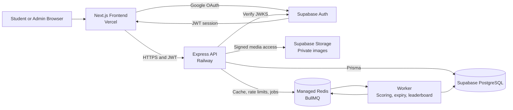
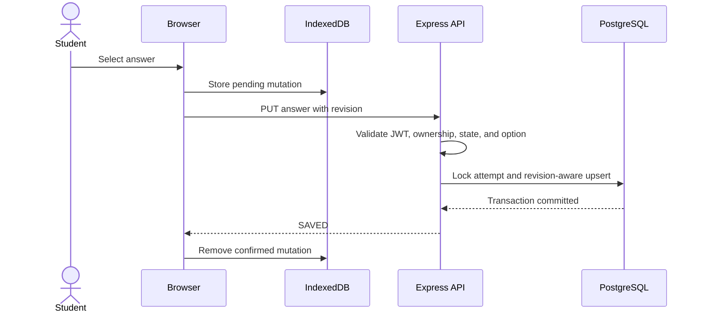
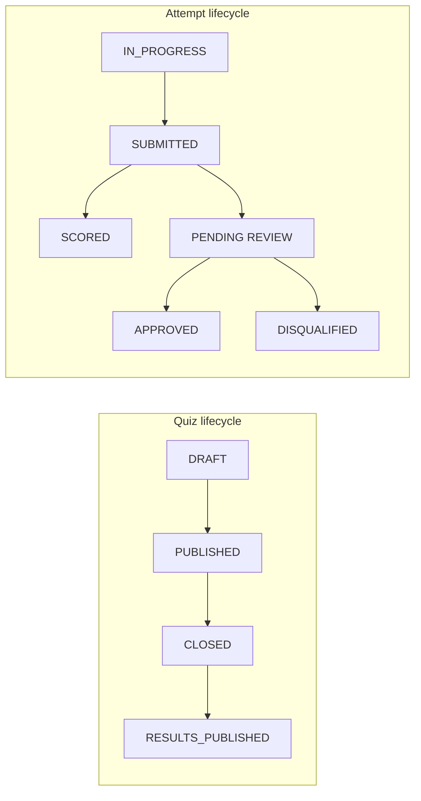

# High-Level Design

## Purpose

This document expands the architecture summarized in the project README. The first release is designed for approximately 3,000 students and must be tested against an exam-style burst of 10,000 concurrent users without introducing unnecessary infrastructure.

## Design principles

- PostgreSQL is the source of truth.
- An answer is reported as saved only after PostgreSQL commits it.
- The API remains stateless and can be horizontally replicated.
- Redis and BullMQ handle secondary work, not answer durability.
- Supabase provides Google authentication, PostgreSQL, and private image storage.
- Backend time, authorization, and attempt state are authoritative.
- Complexity is added only after load tests show a measured need.

## System context

The frontend communicates with Supabase directly only for authentication. Application data is accessed through the backend API.

## Components

### Next.js frontend

- Provides student and admin route groups in one application.
- Uses Supabase Auth for Google sign-in and token refresh.
- Stores unsaved answer mutations in IndexedDB.
- Displays backend-provided attempt timing.
- Runs browser-side MediaPipe/TensorFlow.js detectors.
- Sends violation metadata rather than camera streams.

### Express API

- Verifies Supabase JWTs with cached JWKS.
- Resolves application roles and enrollment from PostgreSQL.
- Validates requests with Zod.
- Implements quiz, attempt, answer, violation, result, and admin APIs.
- Uses one reusable Prisma client per process.
- Writes answers directly to PostgreSQL.
- Enqueues secondary jobs after durable state changes.

### PostgreSQL

- Stores application identities, rosters, quizzes, attempts, answers, violations, and results.
- Enforces uniqueness and relational integrity.
- Uses row-level transaction locks for submission and violation enforcement.
- Receives normal queries through Prisma Client and performance-sensitive queries through Prisma TypedSQL.

### Redis and BullMQ

- Cache read-heavy, non-authoritative data.
- Apply distributed API rate limits.
- Queue scoring, leaderboard, and maintenance jobs.
- Do not store the authoritative answer state.

### Worker

The initial deployment uses one worker service with separate BullMQ processors. It may be horizontally scaled later without splitting it into multiple services.

Worker responsibilities:

- Score submitted attempts.
- Submit expired attempts found by a periodic database scan.
- Recover submitted attempts that do not yet have results.
- Generate leaderboards after quiz closure or result publication.

## Core flows

### Authentication and enrollment

1. The student selects **Continue with Google**.
2. Supabase completes Google OAuth and returns a session containing a JWT.
3. The frontend sends the JWT as a bearer token.
4. The API verifies signature, issuer, audience, expiry, and the configured TIET email domain.
5. The API uses the JWT subject as the permanent application profile ID.
6. The normalized verified email must match an eligible imported roster entry.
7. On first login, `GET /v1/me` returns `ONBOARDING_REQUIRED` and the verified email as read-only display data.
8. The student submits name, roll number, branch, and phone through `POST /v1/onboarding`.
9. The API validates roll number and branch against the roster, checks uniqueness, links the enrollment, and sets `profile_completed_at` in one transaction.
10. On later logins, the same Google identity resolves directly to the completed profile.

A successful Google login does not by itself grant access to a quiz. A different Google identity receives `ACCOUNT_NOT_REGISTERED` even if the user claims the same roll number. Email, roll number, and branch cannot be changed by the student after onboarding; an admin must review corrections.

Supabase remains responsible for access-token renewal and refresh-token rotation. The backend receives only bearer access tokens, does not store refresh tokens, and remains stateless.

### Start or resume attempt

1. Validate authentication, completed profile, enrollment, quiz status, admin availability toggle, and schedule.
2. Return the existing in-progress attempt when one exists.
3. Otherwise create one attempt in a transaction.
4. Set `expires_at` to the earlier of `started_at + duration` and the quiz closing time.
5. Snapshot question order, option order, and scoring values in `attempt_questions`.
6. Return the attempt timing and question snapshot without correctness fields.

The unique `(quiz_id, user_id)` constraint makes concurrent start requests safe.

### Save answer

1. Begin a short transaction and lock the student's attempt row.
2. Confirm the attempt belongs to the student and is `IN_PROGRESS`.
3. Reject the mutation when server time is at or beyond `expires_at`.
4. Confirm the question belongs to the attempt and the option belongs to that question.
5. Upsert the answer only when `client_revision` is newer than the stored revision.
6. Treat the same revision with different content as a conflict.
7. Return success after the transaction commits.
8. The frontend removes the matching IndexedDB mutation only after success.

An unavailable database produces a retryable error; the frontend retains the local mutation.

### Offline synchronization

- The frontend assigns a monotonically increasing revision per question.
- Pending mutations are stored in IndexedDB before the network request.
- Reconnected clients send batches of at most 100 answers.
- The backend processes the batch transactionally or in bounded chunks.
- Duplicate or stale revisions do not overwrite newer answers.
- The client reconciles with the server state after a device change or sequence reset.

### Submission and scoring

1. Lock the attempt row in a short transaction.
2. Treat an already submitted attempt as a successful idempotent request.
3. Reject submission from an unauthorized user.
4. Set status, submission time, and submission reason.
5. Commit before adding a scoring job.
6. Enqueue scoring and return the durable submission state.
7. A periodic recovery scan finds submitted attempts without results if queueing failed.

Scoring reads only PostgreSQL data. Result publication remains a separate admin action.

The answer and submission paths lock the same attempt row. Therefore, an answer racing with submission either commits first and is included, or sees the submitted state and is rejected; it cannot silently commit after final submission.

### Expiry

Every answer and submission request checks `expires_at`, so correctness does not depend on the scheduler. A worker scan periodically finds expired `IN_PROGRESS` attempts and submits them with reason `EXPIRED`.

### Violation enforcement

1. Receive a bounded batch of browser or ML events.
2. Validate detector fields, timestamps, confidence, and duration.
3. Deduplicate repeated events within the configured cooldown.
4. Determine whether the event qualifies under the active policy.
5. Persist the raw event and qualifying incident.
6. Increment the attempt's qualifying count in a transaction.
7. Return warning actions for counts one through four.
8. At count five, submit the attempt with reason `VIOLATION`, block re-entry, and set review status to `PENDING`.

ML events initially require confidence of at least `0.95` sustained for at least three seconds. New detectors remain in shadow mode until calibrated. An admin makes the final validity or disqualification decision.

## Quiz and attempt lifecycle

- Published quiz content is immutable.
- A published quiz accepts new attempts only when `is_enabled = true` and server time is within its schedule.
- Disabling a quiz blocks new attempts but lets existing attempts continue to their existing expiry.
- Closing a quiz is final: it sets the effective closing time, rejects later answers, and causes active attempts to be submitted.
- Schedule timestamps determine whether a published quiz may be started.
- Closing a quiz prevents new attempts but does not erase existing data.
- Publishing results controls student visibility, not whether scoring has run.

## Scaling approach

- Scale stateless API replicas behind Railway networking.
- Keep API and worker database pools deliberately small.
- Use the Supabase pooled URL for runtime traffic and the direct URL for migrations.
- Index all ownership, schedule, answer, and recovery-scan paths.
- Cache only data that can safely be reconstructed from PostgreSQL.
- Generate leaderboards after quiz closure instead of updating ranks on every answer.
- Load-test direct answer writes before considering queued persistence.

Target workload:

- 10,000 authenticated students ramping into an exam.
- Synchronized attempt starts.
- Concurrent answer spikes and offline sync batches.
- 10,000 submissions in a short closing window.
- Answer-save p95 below 300 ms with less than 0.1% API errors.
- Zero loss of answers acknowledged as saved.

## Failure handling

| Failure | Behavior |
| --- | --- |
| PostgreSQL unavailable | Reject writes with retryable errors; frontend retains unsaved answers in IndexedDB. |
| Redis unavailable | Answer saving continues; rate limiting and secondary jobs degrade temporarily. |
| Worker unavailable | Submissions remain durable; scoring and leaderboards resume when the worker recovers. |
| Queue add fails after submission | Recovery scan finds submitted attempts without results and re-enqueues them. |
| API instance stops | Another stateless replica handles subsequent requests. |
| Storage unavailable | Text remains available; image-based questions show a retryable media error. |
| Duplicate requests | Unique constraints, revisions, and idempotent state transitions prevent duplicate effects. |
| Quiz is disabled | New attempts are rejected; active attempts continue and answer saving remains available. |
| Quiz is closed early | Active attempts are submitted through the normal expiry/submission path and later answers are rejected. |

## Concurrency and race-condition handling

| Race | Protection |
| --- | --- |
| Two attempt-start requests | Unique `(quiz_id, user_id)` constraint; return the existing attempt after a conflict. |
| Two answer changes arrive out of order | Conditional upsert accepts only the higher `client_revision`. |
| Same revision carries different answers | Reject with `REVISION_CONFLICT`; the client reloads server state. |
| Answer save races with submit or expiry | Both lock the same attempt row before checking or changing state. |
| Two submit requests | First request changes state; later requests return the existing submitted state. |
| Multiple fifth-violation requests | Event uniqueness plus attempt-row locking allows only one transition to submitted. |
| Scoring job is delivered more than once | Unique result row and idempotent scoring transaction. |
| Admin publishes results twice | Publication transition is idempotent and audited once. |

Locks are scoped to one student's attempt. Students do not block one another during synchronized answer bursts.

## Query efficiency and N+1 prevention

- Never issue one database query per question, option, enrollment, or attempt inside a loop.
- Load attempt questions, options, and saved answers with bounded relation queries or one TypedSQL join.
- Use aggregate queries for admin counts, scoring, and leaderboards.
- Paginate admin lists before loading related records.
- Batch private image URL signing for the visible question set.
- Keep hot-path selections narrow and avoid returning answer-key columns.
- Verify query counts in integration tests and inspect PostgreSQL query plans during load testing.

For 3,000 simultaneous saves, API replicas use small pools and the Supabase pooler controls database concurrency. Each request locks and updates a different student's attempt/answer rows, so the workload does not create one shared row hotspot.

## Edge-case behavior

| Edge case | Expected behavior |
| --- | --- |
| Student clicks Next while save is pending | Navigation continues; IndexedDB retains the mutation and the request is not cancelled. Next does not send a duplicate save. |
| Student changes an option rapidly | Client coalesces pending changes; the highest revision wins on the server. |
| Browser is offline | Show `Offline`, retain mutations, and synchronize when connectivity returns. |
| Manual submit has unsynchronized local answers | Frontend attempts sync first and does not show successful submission until synchronization and submit succeed. |
| Offline through final expiry | Backend submits only answers it received; local-only data cannot be treated as submitted. |
| Response is lost after a database commit | Client retries the same idempotency key and revision and receives the current saved state. |
| User opens multiple tabs | Revisions determine the winner; conflicts cause the stale tab to reload server state. |
| User changes device and revision restarts | Fetch server answers first and continue above the server revision. |
| Quiz closes during an attempt | `expires_at` already uses the earlier closing time; later writes are rejected. |
| Admin disables a published quiz | Block new starts only; do not change existing attempt timers. |
| Published quiz edit is attempted | Reject the change; clone to a new draft instead. |
| Selected option belongs to another question | Reject without changing the saved answer. |
| Duplicate roster rows differ only by case/space | Normalize email and report the duplicate during import. |
| Image signing or loading fails | Keep the attempt active and show a retryable media error; do not reveal a public object URL. |
| Violation timestamps are future or malformed | Store only valid bounded events; reject or mark invalid telemetry without increasing the count. |
| Result is requested before publication | Return `RESULTS_NOT_PUBLISHED`. |
| Negative marking produces a negative total | Preserve the calculated negative score; do not silently floor it to zero. |

## Security and privacy

- Enforce HTTPS and strict CORS allowlists.
- Validate every request at the API boundary.
- Apply ownership checks in services and data queries.
- Never return correct answers before authorized result review.
- Use short-lived signed URLs for private question images.
- Rate-limit authentication-sensitive and write-heavy endpoints.
- Do not log JWTs, answer content, image URLs with signatures, or sensitive ML metadata.
- Keep camera processing in the browser and document consent and retention rules.
- Audit quiz publication, result publication, role changes, and violation-review decisions.

## Initial non-goals

- Microservices per module.
- Custom authentication.
- Queued answer persistence.
- Live per-answer leaderboard updates.
- Read replicas before measured demand.
- Continuous camera upload.
- Permanent disqualification based only on an ML prediction.
